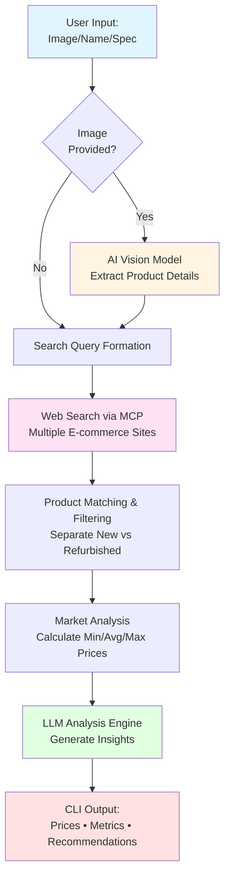

# Competitive Analysis Tool

> **AI-Powered Market Intelligence CLI Tool**

A powerful command-line competitive analysis tool built with **NeuroLink**, designed to help merchants make data-driven pricing decisions through automated market research and intelligent recommendations.

---

## 📋 Executive Summary

This project provides an intelligent CLI tool that empowers merchants to understand their competitive positioning in real-time. By accepting product images, names, or specifications as input, the system analyzes the market landscape and delivers actionable insights including competitor pricing, market trends, and strategic recommendations to increase order volume and revenue.

### Problem Statement

- **Manual price research** is time-consuming and inefficient
- **Lack of real-time market intelligence** leads to missed opportunities
- **Difficulty identifying optimal pricing strategies** results in lost sales
- **No unified view** of competitor landscape across multiple platforms

### Solution

An AI-powered competitive analysis tool that:
- ✅ Accepts multiple input formats (images, product names, specifications)
- ✅ Performs intelligent product identification using AI vision models
- ✅ Gathers real-time pricing data from multiple e-commerce platforms
- ✅ Analyzes market positioning with lowest, average, and highest price metrics
- ✅ Identifies refurbished products separately for accurate comparison
- ✅ Generates actionable business recommendations

---

## 🎯 Key Features

### Multi-Modal Input Processing
- **Product Image**: AI-powered image analysis to identify products from Image
- **Product Name**: Direct text-based product search
- **Product Specification**: Detailed spec-based matching for accurate results

### Intelligent Market Analysis
- **Real-time Price Discovery**: Fetch current prices from multiple online marketplaces
- **Market Metrics**: Automatic calculation of min, max, and average prices
- **Refurbished Product Detection**: Separate tracking of new vs. refurbished offerings
- **Competitor Intelligence**: Identify which platforms sell the product and at what price

### AI-Driven Recommendations
- **Strategic Pricing Suggestions**: AI-generated recommendations based on market data
- **Action Items**: Specific steps merchants can take to increase competitiveness
- **Revenue Optimization**: Insights to maximize order volume and profitability

---

## 🏗️ Technical Architecture

### Technology Stack

| Component | Technology | Purpose |
|-----------|-----------|---------|
| **AI Framework** | [NeuroLink](https://github.com/juspay/neurolink) | Universal AI platform with MCP server integration |
| **LLM Provider** | Google Gemini / OpenAI / Anthropic | Language model for reasoning and recommendations |
| **Vision AI** | Multi-modal LLM (Gemini Vision) | Image analysis and product identification |
| **Web Search** | MCP (Model Context Protocol) / Web Search API | Real-time web search capabilities |
| **Runtime** | Node.js with TypeScript | Type-safe development environment |
| **Interface** | CLI (Command Line Interface) | Efficient Interaction |


---

## 🔄 High-Level Workflow



---

## 📊 Detailed Workflow Stages

### Stage 1: Input Processing
**Input Options:**
- Product image (JPG, PNG)
- Product name (text string)
- Product specifications (JSON/text)

**Process:**
1. If image provided → Send to AI vision model via NeuroLink
2. Extract product name, brand, model, key features
3. Combine with user-provided text inputs
4. Form comprehensive search query

### Stage 2: Web Search & Data Collection
**Process:**
1. Execute web search using MCP integration in NeuroLink
2. Query multiple e-commerce platforms:
   - Amazon
   - Flipkart
   - Other merchant sites
3. Collect product listings with:
   - Website name
   - Product price
   - Product description
   - Product condition (new/refurbished)

### Stage 3: Product Matching & Filtering
**Process:**
1. Apply intelligent filtering to match exact products
2. Eliminate irrelevant or mismatched results
3. Categorize products:
   - **New products** (primary category)
   - **Refurbished products** (separate tracking)

### Stage 4: Market Analysis
**Metrics Calculated:**
- **Lowest Price**: Minimum price found across all platforms
- **Average Price**: Mean price across all listings
- **Highest Price**: Maximum price found
- **Price Distribution**: By platform and product condition

### Stage 5: AI-Powered Recommendations
**Input to LLM:**
- Collected market data
- Merchant's product price
- Merchant's website name
- Product category and market segment

**AI Analysis:**
- Compare merchant pricing vs. market
- Identify competitive advantages/disadvantages
- Generate specific actionable recommendations:
  - Pricing adjustments
  - Marketing strategies
  - Inventory decisions
  - Competitive positioning

### Stage 6: CLI Output
**Formatted Output Includes:**
```
=== Competitive Analysis Report ===

Product: [Identified Product Name]
Your Price: $X.XX on [Your Website]

╔═══════════════════════════════════════════════════╗
║              MARKET PRICE ANALYSIS                ║
╚═══════════════════════════════════════════════════╝

Lowest Price:  $X.XX  (Platform Name)
Average Price: $X.XX
Highest Price: $X.XX  (Platform Name)

╔═══════════════════════════════════════════════════╗
║           COMPETITOR PRICING BREAKDOWN            ║
╚═══════════════════════════════════════════════════╝

1. Amazon      - $X.XX (New)
2. Flipkart    - $X.XX (New)
3. eBay        - $X.XX (Refurbished) *

* Refurbished products listed separately

╔═══════════════════════════════════════════════════╗
║         ACTIONABLE RECOMMENDATIONS                ║
╚═══════════════════════════════════════════════════╝

📊 Strategic Insights:
- [AI-generated market positioning analysis]

💡 Recommended Actions:
1. [Specific pricing recommendation]
2. [Marketing strategy suggestion]
3. [Competitive advantage to leverage]

🎯 Expected Impact:
- Increase order volume by X%
- Improve competitive positioning
- [Additional benefits]
```

---

## 🚀 Getting Started

### Prerequisites

- **Node.js** v18 or higher
- **pnpm** package manager
- **API Keys**:
  - Google AI API Key / OpenAI API Key
  - MCP-compatible search API credentials

### Installation

```bash
# Clone the repository
git clone <repository-url>
cd "Competitive Analysis V2"

# Install dependencies
pnpm install

# Configure environment
cp .env.example .env
# Edit .env with your API keys
```

### Configuration

Create a `.env` file:

```env
# AI Provider Configuration
DEFAULT_PROVIDER="google-ai"
GOOGLE_AI_API_KEY="your-google-ai-api-key"
GOOGLE_AI_MODEL="gemini-2.0-flash-exp"

# Search API Configuration
SERPAPI_API_KEY="your-serpapi-key"

# Optional: Additional providers
OPENAI_API_KEY="your-openai-key"
ANTHROPIC_API_KEY="your-anthropic-key"
```

### Usage

```bash
# Run the CLI tool
pnpm tsx main.ts

# With image input
pnpm tsx main.ts --image product.jpg

# With product name
pnpm tsx main.ts --product "iPhone 15 Pro Max 256GB"

# With specifications
pnpm tsx main.ts --specs "specs.json"
```

---

## � Business Value

### For Merchants
- ⏱️ **Save Time**: Automate hours of manual market research
- 💰 **Increase Revenue**: Data-driven pricing optimization
- 📈 **Boost Competitiveness**: Real-time market intelligence
- 🎯 **Make Better Decisions**: AI-powered strategic recommendations

### ROI Metrics
- **Time Savings**: 90% reduction in manual research time
- **Pricing Accuracy**: Real-time data vs. outdated manual checks
- **Decision Speed**: Instant insights vs. hours/days of analysis
- **Scalability**: Analyze unlimited products without additional effort

---

## 🗺️ Implementation Roadmap

### Phase 1: MVP (Weeks 1-2)
- ✅ Basic CLI interface
- ✅ Text-based product search
- ✅ Web search integration via MCP
- ✅ Simple price comparison output

### Phase 2: AI Enhancement (Weeks 3-4)
- ✅ Image input processing
- ✅ Multi-modal AI integration
- ✅ Advanced product matching
- ✅ AI-powered recommendations

### Phase 3: Market Analysis (Weeks 5-6)
- ✅ Statistical analysis (min/avg/max)
- ✅ Refurbished product detection
- ✅ Competitive positioning insights
- ✅ Formatted CLI reports

### Phase 4: Production Ready (Weeks 7-8)
- 🔄 Error handling and logging
- 🔄 Performance optimization
- 🔄 Comprehensive testing
- 🔄 Documentation and deployment

---

## 📁 Project Structure

```
Competitive Analysis V2/
├── src/
│   ├── cli/                # CLI interface and argument parsing
│   ├── services/
│   │   ├── vision.ts       # Image analysis service
│   │   ├── search.ts       # Web search via MCP
│   │   ├── matcher.ts      # Product matching logic
│   │   └── analyzer.ts     # Market analysis engine
│   ├── models/
│   │   └── types.ts        # TypeScript type definitions
│   └── utils/
│       ├── formatter.ts    # Output formatting
│       └── logger.ts       # Logging utilities
├── main.ts                 # Application entry point
├── .env                    # Environment configuration
├── package.json            # Dependencies and scripts
├── tsconfig.json           # TypeScript configuration
└── README.md              # This file
```

---

## 🔐 Security & Best Practices

- 🔒 API keys stored in environment variables, never committed to version control
- 🛡️ Input validation and sanitization
- 📊 Rate limiting for API calls
- 🔍 Data privacy compliance
- ✅ Error handling and graceful degradation

---

## 📈 Future Enhancements

- **Multi-Language Support**: Analyze international markets
- **Historical Tracking**: Price trends over time
- **API Integration**: REST API for web dashboard integration
- **Advanced Analytics**: Predictive pricing recommendations
- **Batch Processing**: Analyze entire product catalogs
- **Alert System**: Notify merchants of significant price changes
- **Export Options**: Generate PDF/Excel reports

---

## 🤝 Contributing

Contributions are welcome! Please follow these steps:
1. Fork the repository
2. Create a feature branch (`git checkout -b feature/amazing-feature`)
3. Commit your changes (`git commit -m 'Add amazing feature'`)
4. Push to the branch (`git push origin feature/amazing-feature`)
5. Open a Pull Request

---

## 📄 License

ISC License - See LICENSE file for details

---

## 📞 Contact & Support

For questions, issues, or feature requests:
- Open an issue in the repository
- Contact the development team
- Review the [NeuroLink documentation](https://github.com/juspay/neurolink)

---

## 🙏 Acknowledgments

- **NeuroLink Team** at Juspay for the powerful AI framework
- **MCP Community** for standardized AI tool integration
- **AI Provider Partners** (Google, OpenAI, Anthropic)

---

**Note**: This project requires valid API keys to function. Ensure all credentials are configured in your `.env` file before running the application.
